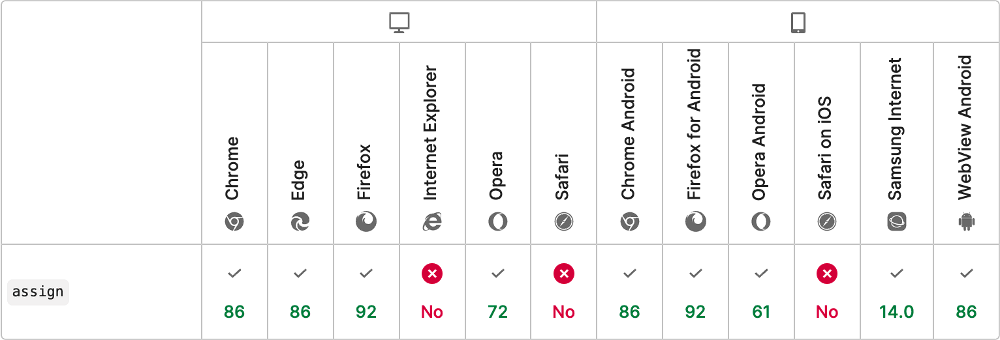

# DOM Slot Assign 

[![NPM Version][npm-img]][npm-url]

**DOM Slot Assign** is a polyfill that allows you to use [imperative slot assignment](https://developer.mozilla.org/en-US/docs/Web/API/HTMLSlotElement/assign), following the [HTML specification](https://html.spec.whatwg.org/multipage/scripting.html#dom-slot-assign).

<a href="https://developer.mozilla.org/en-US/docs/Web/API/HTMLSlotElement/assign#browser_compatibility"></a>

### Usage

Include **DOM Slot Assign** in your project.

```js
import "https://unpkg.com/dom-slot-assign@0.1"
```

```html
<script src="https://unpkg.com/dom-slot-assign@0.1"></script>
```

```js
// npm install dom-slot-assign
import "dom-slot-assign"
```

That’s it. Now use imperative slotting in your project.

The polyfill adds about 1.45 kB to your project, or 729 B when gzipped.

### Example

This example creates a `<content-tabs>` element. From its children, any `<h1>` - `<h6>` element generates a new `<details>` / `<summary>` in its shadow dom, with the heading slotted into the summary. Any content after that heading and before the next heading is added as content to the current details.

```js
customElements.define('content-tabs', class extends HTMLElement {
  constructor() {
    let host = super()
    let root = host.attachShadow({ mode: 'open', slotAssignment: 'manual' })

    root.innerHTML += '<style>::slotted(:is(h1, h2, h3, h4, h5, h6)) { display: contents; pointer-events: none; }</style>'

    if (host.childNodes.length) host.contentChangedCallback()

    new MutationObserver(() => host.contentChangedCallback()).observe(host, { childList: true })
  }
  
  contentChangedCallback() {
    let root = this.shadowRoot
    let [ style ] = root.childNodes
    let details, summary, content

    // clear the shadow root
    root.replaceChildren(style)

    // for each slottable child
    for (let node of this.childNodes) {
      // ignore leading text nodes
      if (!details && node.nodeType !== 1) continue

      // create new summary details with headings
      if (node instanceof HTMLHeadingElement) {
        details = root.appendChild(document.createElement('details'))
        summary = details.appendChild(document.createElement('summary'))
        summary.appendChild(document.createElement('slot')).assign(node)
        content = undefined
      } else {
        // put adjacent comments in summary details below headings
        content = content || details.appendChild(document.createElement('slot'))
        content.assign(...content.assignedNodes(), node)
      }
    }
  }
})
```

[**Open this example on CodePen**](https://codepen.io/jonneal/pen/xxWgyXX?editors=1010)

### How the polyfill works

When the `<slot>` element lacks an `assign()` method, the polyfill is activated.

#### The polyfilled `assign()` method

An `assign()` method works by detecting whether the given slot belongs to a shadow root with manual slot assignment
If it does, it assigns a unique name to the given slot, which is never actually used.
Then, each assigned `Element` node has its `slot` set a separate, private `slot`, which is then appended to the given `slot`.

```jsx
<#shadow-root>
  <!-- public slot created by the user -->
  <slot name="">
    <slot style="display:contents!important" name="">
      <!-- private slot for the first element -->
    </slot>
    <slot style="display:contents!important" name="">
      <!-- private slot for the second element -->
    </slot>
    <slot style="display:contents!important" name="">
      <!-- private slot for the N element -->
    </slot>
  </slot>
</#shadow-root>
```

Assigned `Text` nodes are cloned and each clone is placed inside a private `slot`, which is also appended to the given slot.
The original text nodes are observed for `DOMCharacterDataModified` and `DOMNodeRemoved` to update or remove the clone.

```jsx
<#shadow-root>
  <!-- public slot created by the user -->
  <slot name="">
    <slot style="display:contents!important" name="">
      <!-- private slot for the first element -->
    </slot>
    <slot style="display:contents!important" name="">
      <!-- private slot for the second element -->
    </slot>
    <slot style="display:contents!important" name="">
      A cloned text node.
    </slot>
    <slot style="display:contents!important" name="">
      <!-- private slot for the N element -->
    </slot>
  </slot>
</#shadow-root>
```

#### The polyfilled `assignedNodes()` method

A new `assignedNodes()` method returns an array of all nodes privately assigned to the slot that are still connected.

#### The polyfilled `assignedElements()` method

A new `assignedElements()` method returns an array of all elements privately assigned to the slot that are still connected.

#### The polyfilled `slotAssignment` property

An overriding `attachShadow()` method detects the `slotAssignment: "manual"` option and enables slot elements within the given shadow root to support the `assign` method.
To prevent any accidental ‘named’ slot assignments, the shadow root is observed for `slotchange` to enforce the manual assignment.

[npm-img]: https://img.shields.io/npm/v/dom-slot-assign.svg
[npm-url]: https://www.npmjs.com/package/dom-slot-assign
